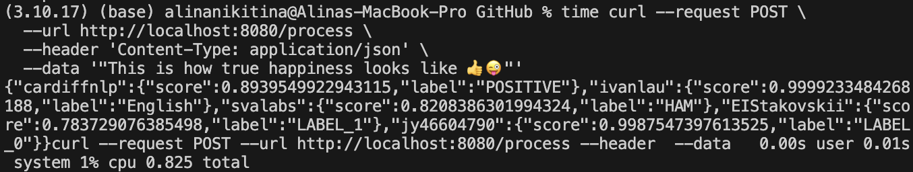
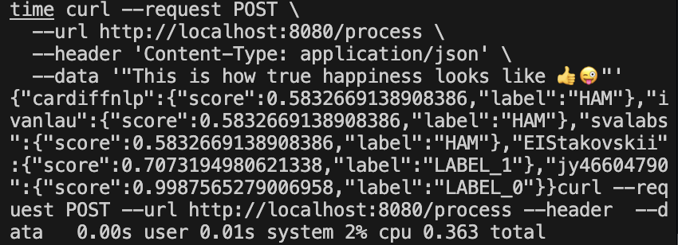

# model-compression-2025

Репозиторий курса по сжатию и ускорению моделей машинного обучения.
ИТМО 2025, направление магистратуры Искуственный интеллект.

Были добавлены следующие оптимизации:
1. Перевод моделей в формат ONNX
2. Квантизация (onnx quantize --avx512)

Сборка проекта:
```bash
cd solution
docker buildx build --platform linux/amd64 --load -t lesson-7 .
```

Для получения новых весов моделей используйте:

```bash
bash quant_models.sh
```

или для скачивания моделей с google drive

```bash
bash down_models.sh
```

Запуск проекта:

```bash
docker run -ti -p 8080:8080 -v $PWD/:/src lesson-7:latestdocker run -ti -p 8080:8080 -v $PWD/:/src lesson-7:latest
```

Работа моделей до оптимизации:    


Работа моделей после оптимизации:   


*План*

    Пара 7 - Примененеие компрессии в реальных задачах.
    Разбор реального примера оптимизации моделей
	Разбор задания финального проекта
    Практика - Как запустить финальные проект
    ДЗ: Оптимизировать модели и улучшить метрики производительности в финальном проекте, создав Pull Request.
        1. сделать Форк данного репозитория, ветки lesson-7-final-task
        2. внести изменения в файл solution/infrastructure/models.py class TransformerTextClassificationModel
        3. проверить локально сборку образа и запуск контейнера командами
            - `docker build -t lesson-7 `
            - `docker run -ti -p 8080:8080 -v $PWD/:/src lesson-7:latest`
            - в случае необходимости внести изменения в requirements.txt и Dockerfile
            - пример курла запроса находится в solution/README.md
        3. В данном классе реализация запуска моделей без каких-либо оптимизаций
        4. Вам нужно применить к ним любые оптимизации
        5. Закоммитить изменения в свою ветку
        6. Сделать Pull Request из своего репозитория ветки lesson-7-final-task в данный репозиторий в ветку lesson-7-final-task
            - в названии пулл реквеста указать команду
            - в описании написать какие оптимизации применили

