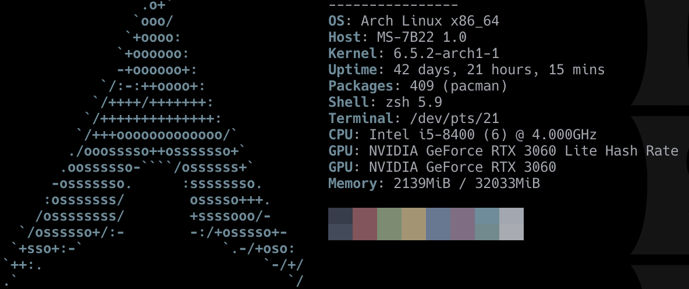
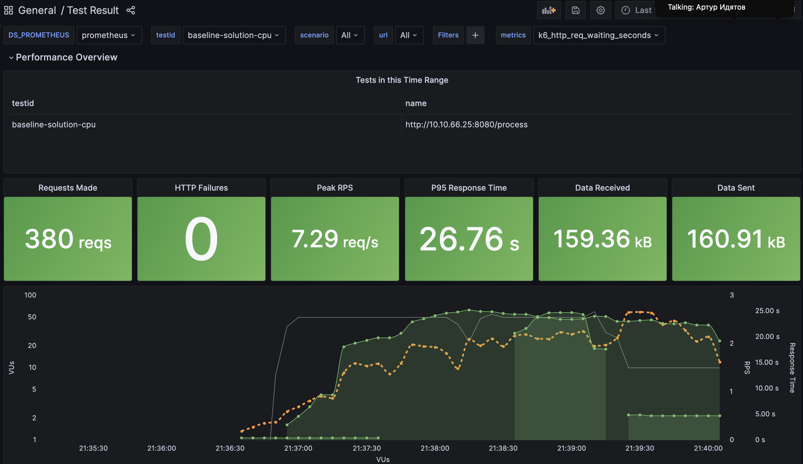
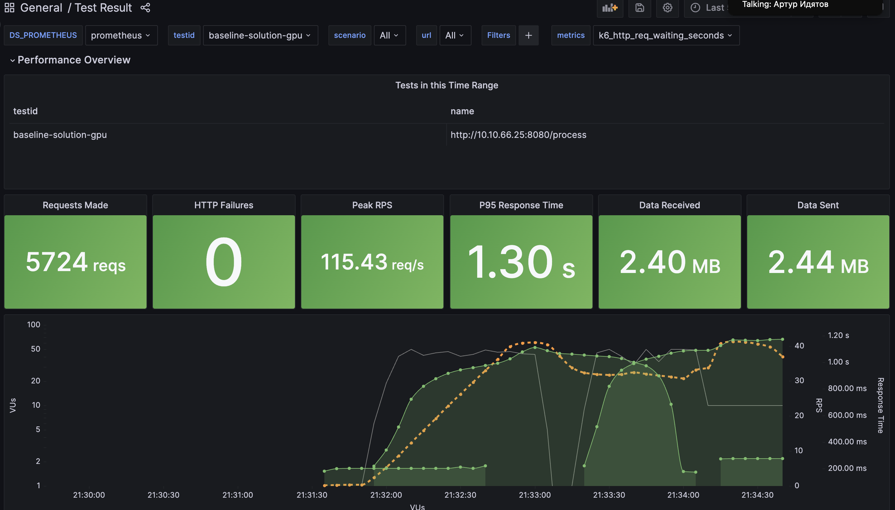

# Домашнее задание #7

## Что было сделано?

1. Применили два метода компрессии, чтобы уменьшить размер модели и ускорить инференс: прунинг (отдельные веса внутри слоя) и квантизация (снижение точности весов модели)
2. Обновили код так, чтобы он возвращал метрики производительности

## Метрики производительности

| type | model |  | score | label | model_total_parameters | model_nonzero_parameters | model_zero_parameters | model_sparsity | model_memory_size_bytes | model_disk_size_bytes | last_inference_time_sec |
|----------|-----------|-----------|-----------|-----------|-----------|-----------|-----------|-----------|------------|-------------|-------------|
| non-optimized | cardiffnlp  | 0.89  | POSITIVE  | 278045955  | 278045187  | 768  | 0.0  | 1112183820  | 1112263328  | 0.19   |
| optimized     | cardiffnlp        | 0.85        | POSITIVE        | 278045955     | 260939825       | 17106130        | 0.06        | 1112183820        | 1112263392        | 0.14         |
| non-optimized | ivanlau  | 0.99  | English  | 278078253  | 278077456  | 797  | 0.0  | 1112313012  | 1112392480  | 0.13   |
| optimized     | ivanlau        | 0.99        | English        | 278078253        | 260965643        | 17112610        | 0.06        | 1112313012        | 1112392544        | 0.13         |
| non-optimized | svalabs  | 0.82  | HAM  | 278045186  | 278044418  | 768  | 0.0  | 1112180744  | 1112260256  | 0.13   |
| optimized     | svalabs        | 0.70        | HAM        | 278045186        | 260939210        | 17105976       | 0.06        | 1112180744       | 1112260320        | 0.12        |
| non-optimized | EIStakovskii  | 0.78  | LABEL_1  | 278045186  | 278044387  | 799  | 0.0  | 1112180744  | 1112260256  | 0.12   |
| optimized     | EIStakovskii        | 0.77        | LABEL_0        | 278045186        | 260939179        | 17106007        | 0.06        | 1112180744        | 1112260320        | 0.11         |
| non-optimized | jy46604790  | 0.99  | LABEL_0  | 124647170  | 124646395  | 775  | 0.0  | 498588680  | 498668192  | 0.12   |
| optimized     | jy46604790        | 0.99      | LABEL_0        | 124647170        | 107541187        | 17105983        | 0.14        | 498588680        | 498668256        | 0.12         |

| type           | model         | score | label     | model_total_parameters | model_nonzero_parameters | model_zero_parameters | model_sparsity | model_memory_size_bytes | model_disk_size_bytes | last_inference_time_sec |
|----------------|---------------|-------|-----------|------------------------|---------------------------|------------------------|----------------|--------------------------|------------------------|--------------------------|
| non-optimized  | cardiffnlp    | 0.89  | POSITIVE  | 278045955              | 278045187                 | 768                    | 0.0            | 1112183820               | 1112263328             | 0.19                     |
| optimized      | cardiffnlp    | 0.85  | POSITIVE  | 278045955              | 260939825                 | 17106130               | 0.06           | 1112183820               | 1112263392             | 0.14                     |
| non-optimized  | ivanlau       | 0.99  | English   | 278078253              | 278077456                 | 797                    | 0.0            | 1112313012               | 1112392480             | 0.13                     |
| optimized      | ivanlau       | 0.99  | English   | 278078253              | 260965643                 | 17112610               | 0.06           | 1112313012               | 1112392544             | 0.13                     |
| non-optimized  | svalabs       | 0.82  | HAM       | 278045186              | 278044418                 | 768                    | 0.0            | 1112180744               | 1112260256             | 0.13                     |
| optimized      | svalabs       | 0.70  | HAM       | 278045186              | 260939210                 | 17105976               | 0.06           | 1112180744               | 1112260320             | 0.12                     |
| non-optimized  | EIStakovskii  | 0.78  | LABEL_1   | 278045186              | 278044387                 | 799                    | 0.0            | 1112180744               | 1112260256             | 0.12                     |
| optimized      | EIStakovskii  | 0.77  | LABEL_0   | 278045186              | 260939179                 | 17106007               | 0.06           | 1112180744               | 1112260320             | 0.11                     |
| non-optimized  | jy46604790    | 0.99  | LABEL_0   | 124647170              | 124646395                 | 775                    | 0.0            | 498588680                | 498668192              | 0.12                     |
| optimized      | jy46604790    | 0.99  | LABEL_0   | 124647170              | 107541187                 | 17105983               | 0.14           | 498588680                | 498668256              | 0.12                     |

## Пояснения

1. model_memory_size_bytes - Объём оперативной памяти (RAM), который занимают все параметры модели после загрузки
2. model_disk_size_bytes - Размер файла, который получается при сохранении состояния модели (state_dict) на диск
3. model_sparsity - Доля обнулённых параметров в модели после прунинга

## Выводы

По скорости инференса прироста почти не заметил, хотя бенчмаркал на предложенном тест-кейсе, возможно, погрешность. Увидел, что методы влияют на некоторые модели: снижают скор, а в одной модели и вовсе предикты лейблов не совпали. Реализованные методы в основном помогли снизить размер моделей, это может быть полезно при деплое на устройства с ограниченными ресурсами

# MLops Challenge


## How to participate?

If you are interested in participating in the challenge, please send us an email with the topic `MLOps Challenge` to challenge-submission@blockshop.org, make sure to add your GitHub email/username and attach your CV.


## Description

Create a service that deploys five NLP models for inference, then receives messages through an exposed POST API endpoint, and finally returns inference results (of all five models) in a single response body.
Expected deliverable is a service packed in the Docker image.

**You service could be a well-configured framework or a self-made API server; use any ML model deployment tool you see fit. There's no language limitation. The most important here is the reusability of a final project.**


### Challenge flow

1. Create a dev branch
2. Submit your solution
3. Create a PR
4. Wait for the test results


## Requirements

### Github

Once you have a collaborator's access to the repository, please create a separate branch for your submission. If you think that your submission is ready, please create a pull request, and assign @rsolovev and @darknessest as reviewers.
We will check your submission, run tests and respond with benchmark results and possibly some comments.

### Folders Structure

Please work on your solution for the challenge inside the `solution` folder.

If you need to add env vars to the container, update values in the Helm chart.
To do that please use `solution/helm/envs/*.yaml`.

Don't forget to update env vars in `autotests/helm/values.yaml`, i.e., `PARTICIPANT_NAME` and `api_host`, to make sure that auto-tests are executed properly.

### Models

For this challenge, you must use the following models. Model's performance optimization is not allowed.

1. https://huggingface.co/cardiffnlp/twitter-xlm-roberta-base-sentiment
2. https://huggingface.co/ivanlau/language-detection-fine-tuned-on-xlm-roberta-base
3. https://huggingface.co/svalabs/twitter-xlm-roberta-crypto-spam
4. https://huggingface.co/EIStakovskii/xlm_roberta_base_multilingual_toxicity_classifier_plus
5. https://huggingface.co/jy46604790/Fake-News-Bert-Detect

### Hardware

Your submission will be deployed on a `g4dn.2xlarge` instance (see [AWS specs](https://aws.amazon.com/ec2/instance-types/g4/)), so please bear in mind the hardware limitations when developing your service.

### Request format

The body of the request for inference only has a text:

```bash
curl --request POST \
  --url http://localhost:8000/process \
  --header 'Content-Type: application/json' \
  --data '"This is how true happiness looks like 👍😜"'
```

Also you can find an example of such a request in `autotests/app/src/main.js`.

### Response format

Your service should respond in the following format. You can also find an example of the expected response in `autotests/app/src/main.js`.

```js
{
    "cardiffnlp": {
        "score": 0.2, // float
        "label": "POSITIVE" // "NEGATIVE", or "NEUTRAL"
    },
    "ivanlau": {
        "score": 0.2, // float
        "label": "English" // string, a language
    },
    "svalabs": {
        "score": 0.2, // float
        "label": "SPAM" // or "HAM"
    },
    "EIStakovskii": {
        "score": 0.2, // float
        "label": "LABEL_0" // or "LABEL_1"
    },
    "jy46604790": {
        "score": 0.2, // float
        "label": "LABEL_0" // or "LABEL_1"
    }
}
```


## Important Notes

- Performance is of paramount importance here, specifically a throughput, and it will be the determining factor in choosing the winner.
- Think about error handling.
- We will be stress-testing your code.
- Consider the scalability and reusability of your service.
- Focus on the application.


## Benchmarks and system info

### system info


### cpu and gpu bencmarks


